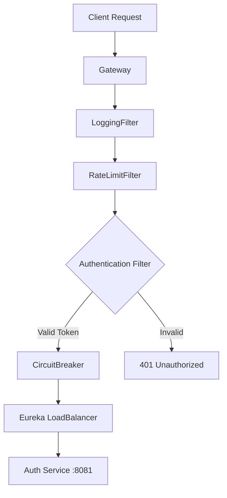

# 🚀 Démarrage et Architecture de l'API Gateway

## 1. Comment démarrer l'API Gateway

Assure-toi d'abord que les services pré-requis sont lancés (Config Server, Eureka, Redis).
Ensuite, ouvre un terminal dans le dossier `api-gateway` et exécute :

```bash
./mvnw spring-boot:run
```

L'application démarrera sur le port **8080**.

---

## 2. Comprendre l'Architecture et le Routage

L'API Gateway agit comme le **portier unique** de ta plateforme bancaire. Voici comment chaque composant que nous avons créé participe au traitement d'une requête.

### 🔄 Flux d'une Requête (Routing Flow)

Quand un client (React, Mobile) envoie une requête (ex: `POST /api/auth/login`), voici le chemin parcouru :

1.  **Entrée** : La requête arrive sur le port 8080.
2.  **Route Locator (`GatewayConfig.java`)** : Le Gateway analyse l'URL.
    - Il voit `/api/auth/**`.
    - Il identifie que cette route correspond au service `auth-service`.
3.  **Chaîne de Filtres** : Avant d'envoyer la requête au service, elle traverse une série de filtres définis dans `GatewayConfig`.



### 🧩 Les Composants Clés

#### 1. `GatewayConfig.java` (Le Chef de Gare)

C'est ici que les règles de routage sont définies.

- **Rôle** : Mappe les URLs (ex: `/api/auth/**`) vers les services (ex: `lb://AUTH-SERVICE`).
- **Configuration** : Il applique les filtres spécifiques à chaque route.
- **Resilience** : Il configure aussi le `CircuitBreaker` (pour gérer les pannes) et le `Retry` (pour réessayer en cas d'échec temporaire).

#### 2. `SecurityConfig.java` (La Sécurité Réactive)

- **Rôle** : Configuration globale de Spring Security.
- **Spécificité** : Comme nous utilisons Spring Cloud Gateway (basé sur WebFlux), cette configuration est **non-bloquante** (Reactive).
- **Action** : Elle désactive CSRF (inutile pour les APIs REST stateless), autorise les accès (car nous gérons l'auth finement dans les filtres), et sécurise les headers HTTP.

#### 3. `AuthenticationFilter.java` (Le Garde du Corps)

- **Rôle** : Vérifie l'identité de l'utilisateur.
- **Action** :
  1.  Intercepte la requête.
  2.  Regarde le header `Authorization`.
  3.  Valide le Token JWT via `JwtTokenProvider`.
  4.  **Si OK** : Il injecte l'email et le rôle de l'utilisateur dans les headers de la requête (`X-User-Email`) pour que le microservice final sache qui appelle.
  5.  **Si KO** : Il rejette la requête immédiatement (401 Unauthorized) sans déranger le microservice.

#### 4. `RateLimitFilter.java` (Le Contrôleur de Trafic)

- **Rôle** : Protège tes services contre la surcharge et les attaques DDOS.
- **Action** : Utilise **Redis** pour compter le nombre de requêtes par utilisateur (ou IP). Si la limite (ex: 100 req/min) est dépassée, il renvoie une erreur 429.

#### 5. `LoggingFilter.java` (L'Espion)

- **Rôle** : Observabilité.
- **Action** : Note chaque requête qui entre et chaque réponse qui sort, avec le temps que cela a pris (latence). C'est crucial pour le débogage.

---

### En résumé

L'API Gateway ne se contente pas de "passer les plats". Elle :

1.  **Dirige** (Routing)
2.  **Sécurise** (Auth & Rate Limit)
3.  **Protège** (Circuit Breaker)
4.  **Observe** (Logging)

C'est une couche d'abstraction indispensable qui permet à tes microservices (Auth, Account, etc.) de se concentrer uniquement sur leur métier sans gérer la sécurité ou le trafic réseau.
